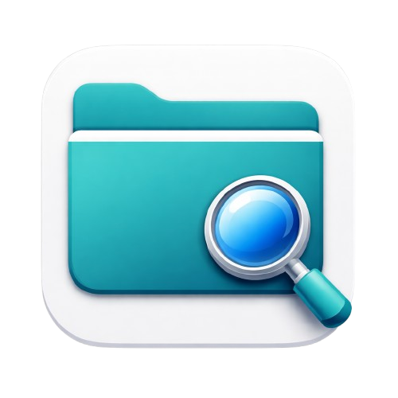

# NovaExtract

<div align="center">



**A powerful and intuitive file extraction and compression tool for macOS**

[](https://flutter.dev)
[](https://dart.dev)
[](https://www.apple.com/macos)
[](LICENSE)

</div>

## 📖 Sobre

NovaExtract é um aplicativo nativo para macOS desenvolvido com Flutter que oferece uma solução completa e intuitiva para extração e compressão de arquivos. Com uma interface moderna e integração nativa com o sistema operacional, o NovaExtract simplifica o trabalho com arquivos comprimidos.

## ✨ Funcionalidades

### 📦 Extração
- ✅ Suporte a múltiplos formatos: **ZIP, TAR, TAR.GZ, TAR.BZ2, GZ, BZ2**
- ✅ Visualização prévia do conteúdo dos arquivos
- ✅ Navegação hierárquica dentro de arquivos comprimidos
- ✅ Histórico completo de extrações
- ✅ Interface drag & drop intuitiva

### 🗜️ Compressão
- ✅ Criação de arquivos em múltiplos formatos: **ZIP, TAR, TAR.GZ, TAR.BZ2**
- ✅ Seleção de múltiplos arquivos e pastas
- ✅ Escolha personalizada do nome e localização
- ✅ Interface moderna e responsiva

### 🎨 Interface
- ✅ Design Cupertino nativo do macOS
- ✅ Suporte a tema claro e escuro
- ✅ Animações suaves e transições elegantes
- ✅ Totalmente otimizado para macOS

### ⚡ Integração com o Sistema
- ✅ Menu de contexto do Finder integrado
- ✅ Extraia e comprima arquivos diretamente do Finder
- ✅ Suporte completo para macOS Services

### 🌍 Internacionalização
- ✅ Suporte para **Inglês** e **Português**
- ✅ Interface totalmente localizada

## 🛠️ Tecnologias

- **Flutter** - Framework multiplataforma
- **Dart** - Linguagem de programação
- **Cupertino Design** - Interface nativa macOS
- **Archive Package** - Processamento de arquivos comprimidos
- **Riverpod** - Gerenciamento de estado
- **Method Channels** - Comunicação nativa Swift-Flutter

## 📋 Requisitos

- macOS 10.14 ou superior
- Flutter 3.9+ (para desenvolvimento)

## 🚀 Instalação

### Para Usuários

1. Baixe a versão mais recente do [releases](https://github.com/kingtirano/novaextract/releases)
2. Abra o arquivo `.dmg`
3. Arraste o NovaExtract para a pasta Applications
4. Execute o aplicativo

### Para Desenvolvedores

```bash
# Clone o repositório
git clone https://github.com/kingtirano/novaextract.git
cd novaextract

# Instale as dependências
flutter pub get

# Execute o aplicativo
flutter run -d macos
```

## 📸 Screenshots

[Screenshots serão adicionadas aqui]

## 🏗️ Estrutura do Projeto

```
novaextract/
├── lib/
│   ├── core/           # Configurações centrais
│   │   └── localizations.dart
│   ├── models/         # Modelos de dados
│   │   ├── archive_file.dart
│   │   └── extraction_history.dart
│   ├── views/          # Telas principais
│   │   ├── home_page.dart
│   │   ├── compress_view.dart
│   │   ├── history_view.dart
│   │   └── settings_view.dart
│   ├── widgets/        # Componentes reutilizáveis
│   │   ├── sidebar.dart
│   │   ├── drop_zone.dart
│   │   ├── file_details.dart
│   │   └── ad_banner.dart
│   └── main.dart        # Ponto de entrada
├── macos/               # Configurações macOS
├── assets/              # Recursos (ícones, imagens)
└── pubspec.yaml         # Dependências do projeto
```

## 🤝 Contribuindo

Contribuições são bem-vindas! Sinta-se à vontade para:

1. Fazer fork do projeto
2. Criar uma branch para sua feature (`git checkout -b feature/AmazingFeature`)
3. Commit suas mudanças (`git commit -m 'Add some AmazingFeature'`)
4. Push para a branch (`git push origin feature/AmazingFeature`)
5. Abrir um Pull Request

## 📝 Licença

Este projeto está sob a licença MIT. Veja o arquivo [LICENSE](LICENSE) para mais detalhes.

## 👨‍💻 Desenvolvedor

**Artur Martins - Tirano Tech**

- GitHub: [@kingtirano](https://github.com/kingtirano)
- LinkedIn: [Artur Martins](https://www.linkedin.com/in/artur-martins)

## 🙏 Agradecimentos

- Flutter team pelo framework incrível
- Comunidade open source pelos pacotes utilizados
- Todos os contribuidores e usuários do NovaExtract

---

<div align="center">

Desenvolvido com ❤️ por **Artur Martins - Tirano Tech**

⭐ Se você gostou do projeto, considere dar uma estrela!

</div>
